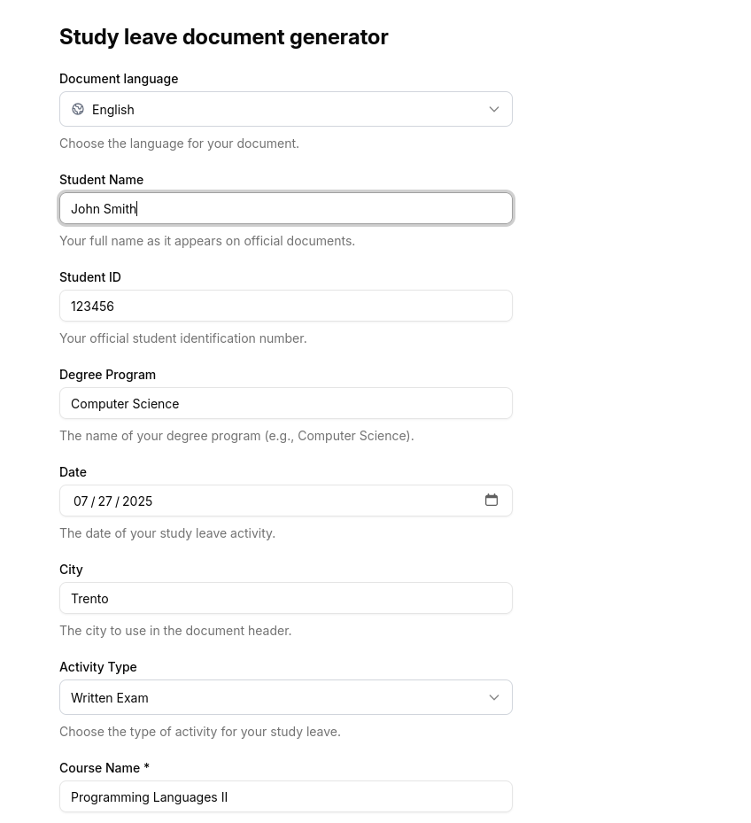
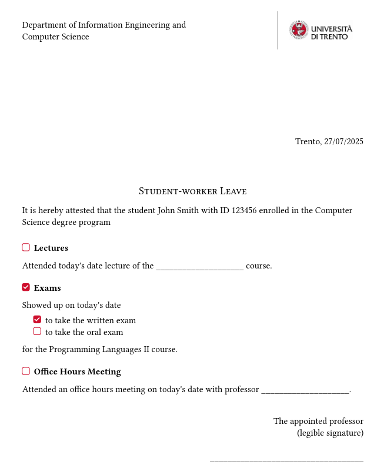

# Study Leave Document Generator

A web application that generates official study leave documents for Italian steelworker contract holders who are entitled to paid study leave as students.

## Context

In Italy, steelworker contracts offer paid study leave to employees who are also students. To receive this benefit, workers must provide a document signed by the appointed professor specifying the type of academic activity they need to attend.

This application automates the generation of these official documents by providing a simple web interface where users can input their details and generate properly formatted PDF documents.

## Features

- As of now, the application supports the following academic activities:
    - Lectures
    - Oral exams
    - Written exams
    - Office hours meetings

- The document can be generated in both Italian and English
- The document is generated in PDF format using the Typst templating system. This works by injecting parameters into a template

## Screenshots

### Web Interface

### Generated Document

## Tech Stack

- **Backend**: FastAPI (Python)
- **Frontend**: React with Vite
- **PDF Generation**: Typst templating system  
- **Validation**: Pydantic models
- **Styling**: Modern UI components

## API Endpoints

- `GET /document/activity-types` - Get available activity types
- `GET /document/supported-languages` - Get supported languages  
- `POST /document/build` - Generate PDF document

The application ensures that the right fields are required based on the selected activity type (e.g., course name for exams, professor name for office hours).